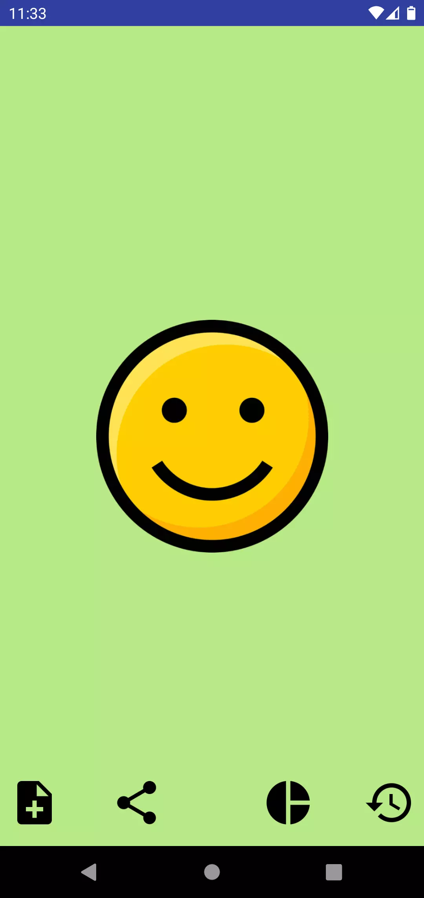
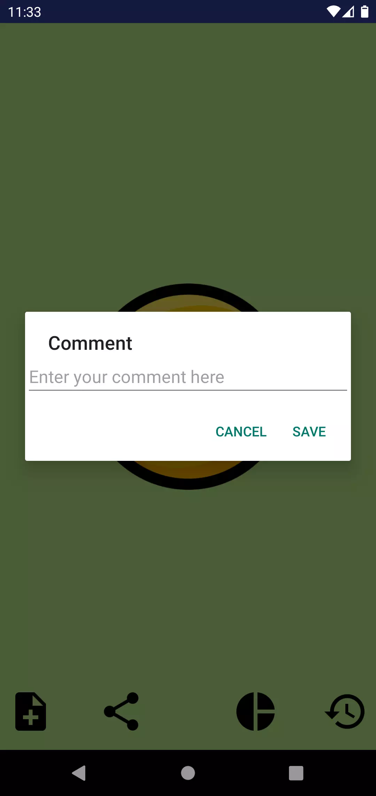
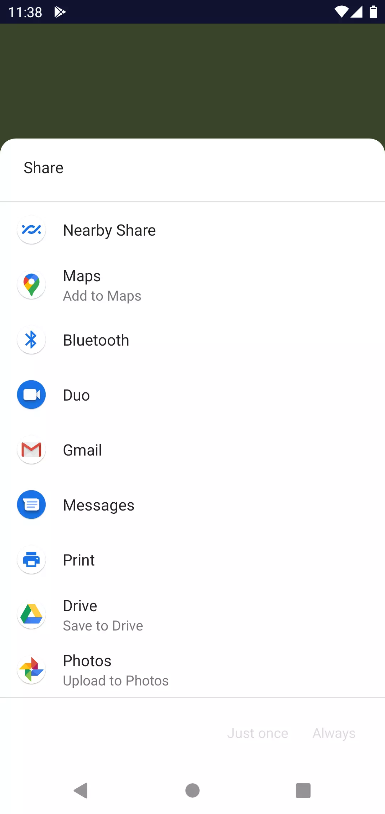
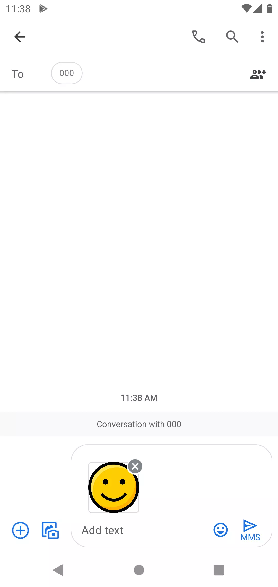
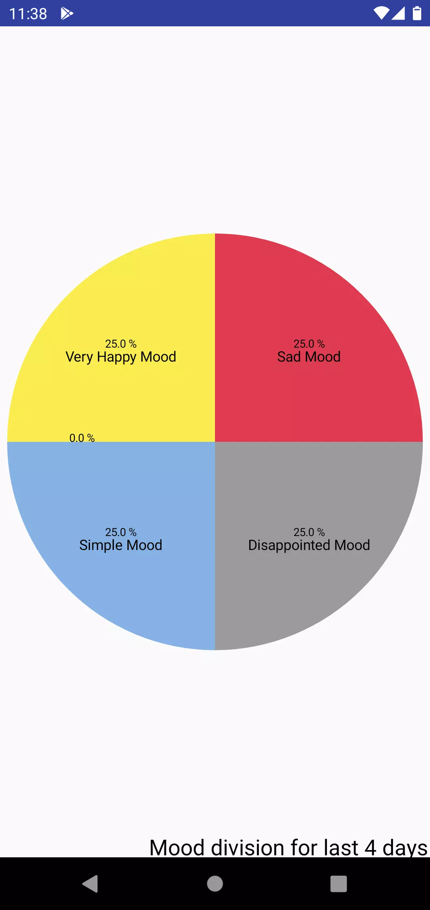
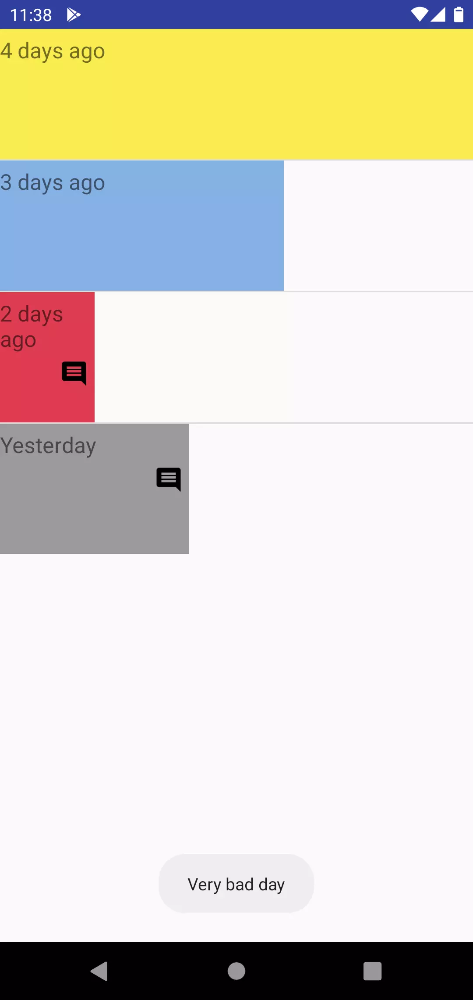

# MoodTracker

My first Android app

## Description

A very simple app to learn the basics of Java and Android.  

Training to use

    - Java
    - Oriented object programming
    - Json
    - SharedPreferences
    - Activity
    - Intent
    - GestureDetector
    - ListView

## Features

    - Scroll on home screen to select your current mood
    - Add a comment with your mood
    - Share the icon and your comment
    - See the repartition of your moods from 7 days
    - See the history of your moods on the last 7 days

## Run on

You can run the app directly after download or clone the repository

## ScreenShot

Home page

Add a comment

Share your mood and your comment

Repartition of mood with a pie chart

History of your mood

